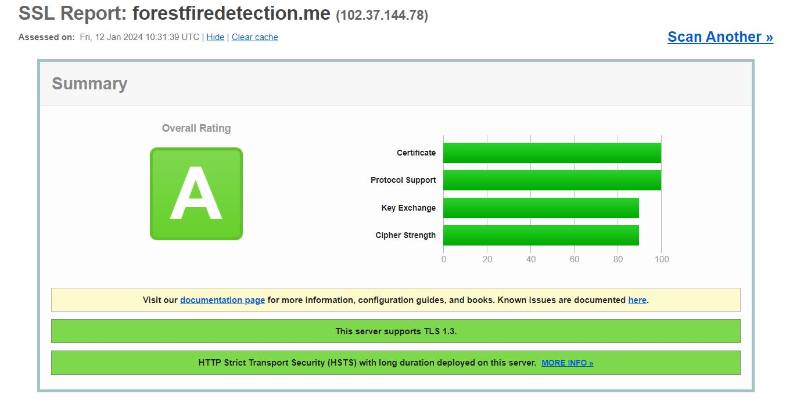
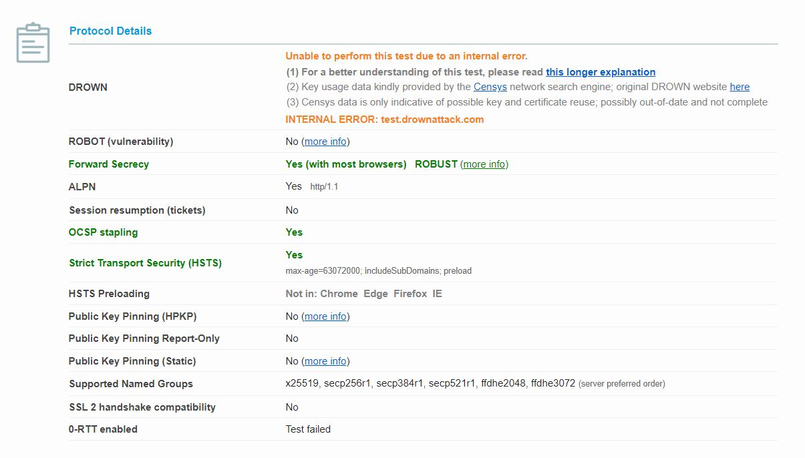

# Forest Fire Detection
## Context
The "Forest Fire Detection" project is dedicated to the conception and realization of a comprehensive prototype that culminates in an innovative mobile application. This application, accessible through the domain [forestfiredetection.me](https://forestfiredetection.me), is hosted on an Azure virtual machine. It provides real-time notifications in the event of a forest fire and precise directions to the nearest water source.

## Key Features

### Real-time Notifications

The mobile application delivers instant notifications as soon as a forest fire is detected, ensuring maximum responsiveness to potential threats.

### Guidance to the Water Source

In emergency situations, the application provides an optimized route to the nearest water source, facilitating evacuation and effective crisis management.

### Hosted on Azure

Thanks to a robust infrastructure based on an Azure virtual machine, the application guarantees consistent availability and easy accessibility via [forestfiredetection.me](https://forestfiredetection.me).


## Installation guide
### Technologies
Multiple technologies, packages and hardware sensors were used in order to develop our his project, the technologies are diverse and used for backend and frontend development.
#### Backend:
  - MongoDB
  - MQTT
  - Jakarta EE
  - WildFly
  - Other usefull Jakarta EE packages
#### Frontend:
  - HTML
  - CSS
  - js
#### Server:
  -   Mosquitto broker
#### Hardware:
  -   Nvidea jetson nano 4G
GPU	: NVIDIA Maxwell architecture with 128 NVIDIA CUDA® cores
Camera	: 12 lanes (3x4 or 4x2) MIPI CSI-2 D-PHY 1.1 (1.5 Gb/s per pair)
Connectivity :	Gigabit Ethernet, M.2 Key E
Display	: HDMI 2.0 and eDP 1.4
USB	: 4x USB 3.0, USB 2.0 Micro-B
  -   camera Redragon
Résolution vidéo max : Full HD 1080p
30 FPS avec autofocus
### Deployment Server:
We used our free Microsoft accounts in order to sign in and get 100$ offred by Microsoft Azure. This allowed us to create a virtual machine capable of hosting the Middleware (i.e. Jakarta EE), the MQTT Broker (i.e. Mosquitto) and handle several requests without delay. The characteristics of the virtual machine are as follow:
  - Ram: 1 GB
  - CPU: 1 GB
  - Storage: 35 GB
###  IoT prototype:

### Detection model:
The Forest Fire Detection system utilizes the YOLOv8 (You Only Look Once version 8) object detection model for accurate and real-time fire detection. YOLOv8 is a state-of-the-art model known for its speed and precision in identifying objects in images and video frames.
To test the fire detection model on the NVIDIA card, follow these steps:
1. Make sure you have Python3 installed on your system.
2. Navigate to the project directory:
   ```bash
   python3 detection_test.py
## Certification and Grading:
HTTPS was enabled using Let's Encrypt's Certbot, allowing us to verify the ownership of our domain www.modernparker.me and to make connections to our website secure. We also generated stronger Dephi-Helman parameters for the TLS connection with a length of 4096 bits. Thanks to this, and also thanks to some Jakarta EE parameters, we were able to disable TLS 1.3 and enforce a stronger communication with our project. We were able to grade A validation from SSLLabs as Overall Rating.


## Screenshots
   

## Further Readings
You can find more detailed information and take a look at the architecture design in the following documents:

- [Design Document](docs/DesignDocument.md)
- [Scope of Statement](docs/ScopeOfStatement.md)

## contribution:
This project is carried out in collaboration with:
  - Mezghani Mariem
  - Wissal Oueslati
